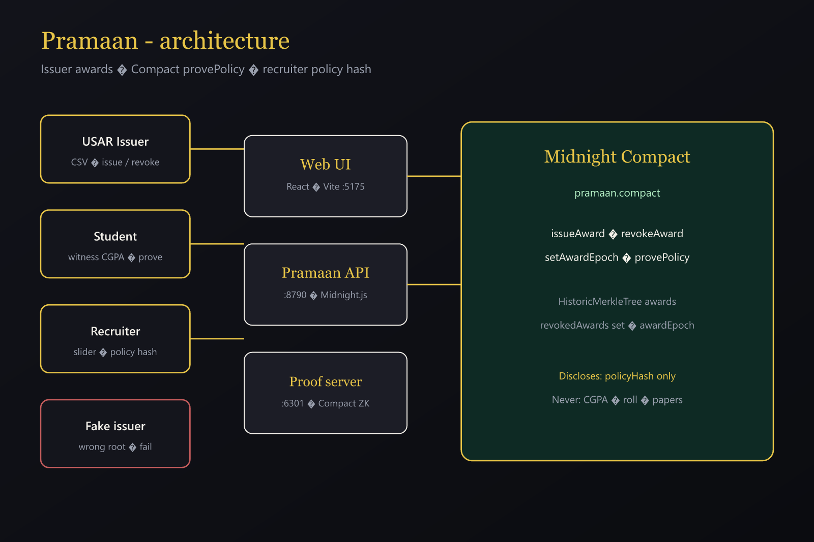
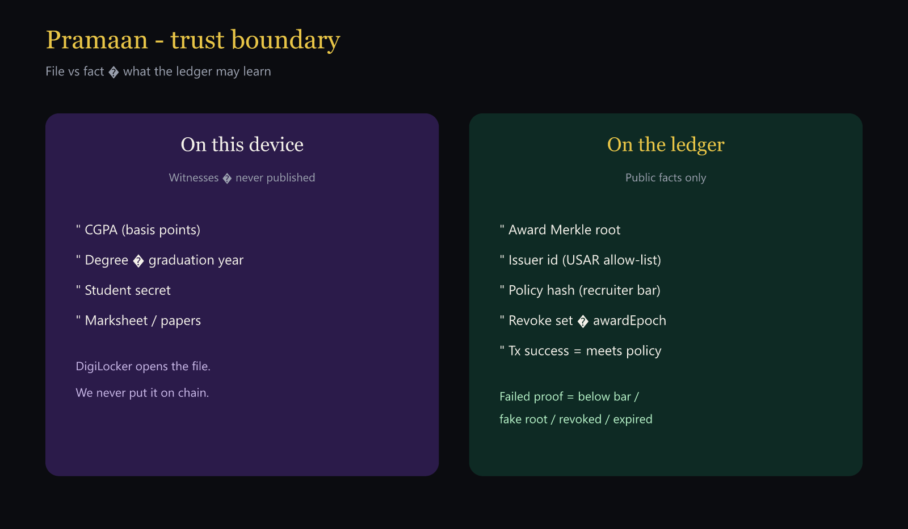

# Pramaan

**Prove the cutoff. Keep the marksheet.**

Brainwave 2026 - Midnight Track. A **placement-cell pilot product**: Compact proves an issued academic leaf meets a recruiter’s policy. The ledger learns pass/fail and the policy hash. It never learns CGPA, roll, or papers.

| Private (device) | Public (ledger) |
| --- | --- |
| CGPA, degree, year, student secret | Award root, issuer id, policy hash |
| Marksheet / papers | Revoke set, awardEpoch, tx outcome |

Sibling of [Silent Bell](https://github.com/HawaleShailesh004/silentbell) — same LEAF Merkle muscle, different door.

## Docs for judges

| Doc | Purpose |
| --- | --- |
| [OVERVIEW.md](OVERVIEW.md) | Human story - problem → Midnight → product |
| [docs/DEVPOST.md](docs/DEVPOST.md) | Paste-ready Devpost description |
| [docs/DEMO-SCRIPT.md](docs/DEMO-SCRIPT.md) | What to show / what to say |
| [docs/ARCHITECTURE.md](docs/ARCHITECTURE.md) | Components + circuits |
| [COMPAT.md](COMPAT.md) | Versions + personas + Preview address |
| [docs/media/](docs/media/) | Architecture SVGs + thumbnail prompts |





## Sponsor stack

- **Compact** - `contracts/pramaan.compact` (`issueAward`, `revokeAward`, `setAwardEpoch`, `provePolicy`)
- **Midnight.js 4.1.1** - deploy + callTx
- **proof-server 8.1.0** - proving
- **node + indexer** - local Docker / Preview public endpoints
- **Preview faucet** - public-network funding for eligibility

## Quick start (local)

```bash
cd pramaan
npm install && npm --prefix web install
npm run compile
npm run setup
npm run api          # :8790
npm run web          # :5175
```

Open **http://localhost:5175/** → **#demo** or **#recruiter** (personas in `COMPAT.md`).

Ports are offset from Silent Bell (9945 / 8089 / 6301 / 8790 / 5175) so both stacks can run.

## Product flows

1. **Issuer** - CSV awards → hashed leaves → revoke on correction.
2. **Student** - private CGPA on device → prove for recruiter policy.
3. **Recruiter** - cutoff slider → live policy hash → Meera / Kabir / Arya.
4. **Bar moved** - same leaf, 8.0 → Meera fails (theatrical beat).
5. **Fake uni** - untrusted root → FailWell.
6. **Explorer** - counts + receipt policy hashes.
7. **Live demo** - one-click cast for judges.

## Public deploy (Midnight Preview - eligibility)

**Network:** Preview  
**Contract:** `34448964df7df052fa142ce6b3b3635a7f5613d1831323e3aae50d19f4c3179d`  
**Deployer:** `mn_addr_preview1gzflnqjccr8tr6muekygdsa8tk5q6w5du0fd59jp5wlhl0qmu44shcwkw6`  
**Explorer:** https://explorer.preview.midnight.network/  
**Deployed:** 2026-08-26

```bash
npm run network preview
npx tsx src/print-address.ts --network preview
# Fund mn_addr_preview… at https://faucet.preview.midnight.network
npx tsx src/pramaan-deploy.ts --network preview
```

## PreProd (optional twin)

Prefer Preview for eligibility. PreProd sync/faucet can hang.

```bash
npx tsx src/print-address.ts --network preprod
# Fund at https://faucet.preprod.midnight.network
npx tsx src/pramaan-deploy.ts --network preprod
```

## Threat model (pilot)

| Threat | Mitigation |
| --- | --- |
| Marksheet on chain | Witness-only CGPA; failed/success tx, not PDF |
| Recruiter bait-and-switch | Policy hash bound in proof |
| Fake university | Leaf not in trusted issuer tree |
| Corrected grades | Revocation set |
| Stale proofs | awardEpoch cohort floor |
| Exact score fishing | Default L0 boolean; no L2 lead |

Not affiliated with NAD, UGC, or GGSIPU. Synthetic personas only.

## Layout

- `contracts/pramaan.compact`
- `src/` - deploy, API, witnesses, receipts
- `web/` - product UI
- `docs/` - Devpost, demo script, architecture, media
- `scripts/` - compile, fixtures, e2e
